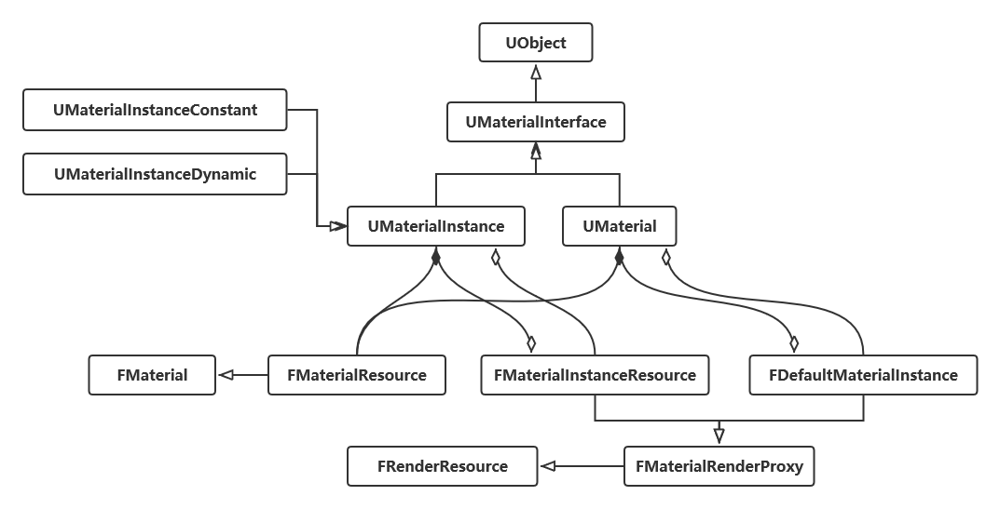
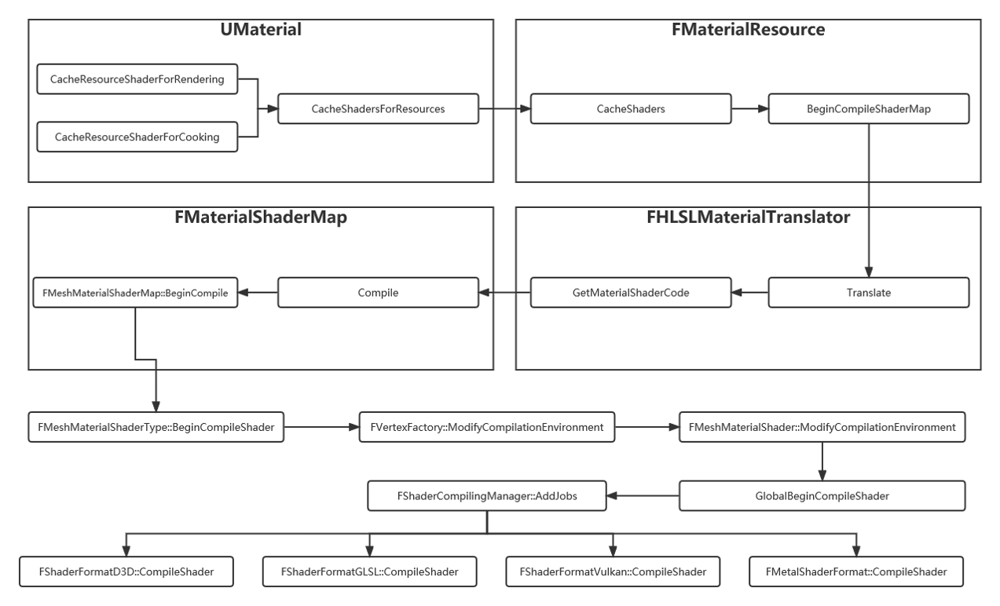

# Material & Shader





## UMaterial -> UMaterialInterface
* A Material is an asset which can be applied to a mesh to control the visual look of the scene. 
* When light from the scene hits the surface, the shading model of the material is used to calculate how that light interacts with the surface. 
* Warning: Creating new materials directly increases shader compile times!  Consider creating a Material Instance off of an existing material instead.
```cpp
/* Get the static permutation resource if the instance has one */
virtual FMaterialResource* GetMaterialResource(ERHIFeatureLevel::Type InFeatureLevel, EMaterialQualityLevel::Type QualityLevel = EMaterialQualityLevel::Num) { return NULL; }

virtual const FMaterialResource* GetMaterialResource(ERHIFeatureLevel::Type InFeatureLevel, EMaterialQualityLevel::Type QualityLevel = EMaterialQualityLevel::Num) const { return NULL; }
```


## UMaterialInstance -> UMaterialInterface
```cpp
/** Parent material. */
UPROPERTY(EditAnywhere, BlueprintReadOnly, Category=MaterialInstance, AssetRegistrySearchable)
class UMaterialInterface* Parent;

/* FMaterialRenderProxy derivative that represent this material instance to the renderer, when the renderer needs to fetch parameter values. */
class FMaterialInstanceResource* Resource;
```


## FMaterialCompiler
 * The interface used to translate material expressions into executable code. 
 * Note: Most member functions should be pure virtual to force a FProxyMaterialCompiler override!


## FMaterial
* Represents a material to the material compilation process, and provides hooks for extensibility (CompileProperty, etc)
* Represents a material to the renderer, with functions to access material properties
* Stores a cached shader map, and other transient output from a compile, which is necessary with async shader compiling
  * when a material finishes async compilation, the shader map and compile errors need to be stored somewhere
```cpp
/* Game thread tracked shader map, which is ref counted and manages shader map lifetime. 
 * The shader map uses deferred deletion so that the rendering thread has a chance to process a release command when the shader map is no longer referenced.
 * Code that sets this is responsible for updating RenderingThreadShaderMap in a thread safe way.
 * During an async compile, this will be NULL and will not contain the actual shader map until compilation is complete. */
TRefCountPtr<FMaterialShaderMap> GameThreadShaderMap;

/* Shader map for this material resource which is accessible by the rendering thread. 
 * This must be updated along with GameThreadShaderMap, but on the rendering thread. */
TRefCountPtr<FMaterialShaderMap> RenderingThreadShaderMap;

/** Quality level that this material is representing, may be EMaterialQualityLevel::Num if material doesn't depend on current quality level */
EMaterialQualityLevel::Type QualityLevel;

/** Feature level that this material is representing. */
ERHIFeatureLevel::Type FeatureLevel;
```

## FMaterialResource -> FMaterial
* Implementation of the FMaterial interface for a UMaterial or UMaterialInstance.
```cpp
public:
	void SetMaterial(UMaterial* InMaterial, UMaterialInstance* InInstance, ERHIFeatureLevel::Type InFeatureLevel, EMaterialQualityLevel::Type InQualityLevel = EMaterialQualityLevel::Num)
	{
		Material = InMaterial;
		MaterialInstance = InInstance;
		SetQualityLevelProperties(InFeatureLevel, InQualityLevel);
	}
protected:
	UMaterial* Material;
	UMaterialInstance* MaterialInstance;
	mutable FStrataMaterialInfo CachedStrataMaterialInfo;
```


## FShader
* A compiled shader and its parameter bindings.

## FMaterialShader -> FShader
* Base class of all shaders that need material parameters

## FShaderType
* An object which is used to serialize/deserialize, compile, and cache a particular shader class.
* A shader type can manage multiple instance of FShader across mutiple dimensions such as EShaderPlatform, or permutation id. The number of permutation of a shader type is simply given by GetPermutationCount().


## FShaderMapContent
* A collection of shaders of different types


## FMaterialShaderMap -> FShaderMapContent
* The set of material shaders for a single material.
```cpp
public:
	/** Finds the shader map for a material. */
	static TRefCountPtr<FMaterialShaderMap> FindId(const FMaterialShaderMapId& ShaderMapId, EShaderPlatform Platform);

	/** Registers a material shader map in the global map so it can be used by materials. */
	void Register(EShaderPlatform InShaderPlatform);


// Globals
FCriticalSection FMaterialShaderMap::GIdToMaterialShaderMapCS;
TMap<FMaterialShaderMapId,FMaterialShaderMap*> FMaterialShaderMap::GIdToMaterialShaderMap[SP_NumPlatforms];

```

## FMeshMaterialShaderMap -> FShaderMapContent
* The shaders which the render the material on a mesh generated by a particular vertex factory type.


## FMaterialShaderMapId
* Contains all the information needed to uniquely identify a FMaterialShaderMap.
```cpp
public:
	FSHAHash CookedShaderMapIdHash;

#if WITH_EDITOR
	/* The base material's StateId.  
	 * This guid represents all the state of a UMaterial that is not covered by the other members of FMaterialShaderMapId.
	 * Any change to the UMaterial that modifies that state (for example, adding an expression) must modify this guid. */
	FGuid BaseMaterialId;
#endif
	/* Quality level that this shader map is going to be compiled at.  
	 * Can be a value of EMaterialQualityLevel::Num if quality level doesn't matter to the compiled result. */
	EMaterialQualityLevel::Type QualityLevel;

	/** Feature level that the shader map is going to be compiled for. */
	ERHIFeatureLevel::Type FeatureLevel;
```


---

## FMaterialRenderProxy -> FRenderResource
* A material render proxy used by the renderer.
* On FMeshBatch : A batch of mesh elements, all with the same material and vertex buffer
```cpp
// These functions should only be called by the rendering thread.
/*  Finds the FMaterial to use for rendering this FMaterialRenderProxy.  Will fall back to a default material if needed due to a content error, or async compilation.
    * The returned FMaterial is guaranteed to have a complete shader map, so all relevant shaders should be available OutFallbackMaterialRenderProxy - The proxy that corresponds to the returned FMaterial, should be used for further rendering.  May be a fallback material, or 'this' if no fallback was needed */
const FMaterial& GetMaterialWithFallback(ERHIFeatureLevel::Type InFeatureLevel, const FMaterialRenderProxy*& OutFallbackMaterialRenderProxy) const;

/** * Finds the FMaterial to use for rendering this FMaterialRenderProxy.  Will fall back to a default material if needed due to a content error, or async compilation.
    * Will always return a valid FMaterial, but unlike GetMaterialWithFallback, FMaterial's shader map may be incomplete */
const FMaterial& GetIncompleteMaterialWithFallback(ERHIFeatureLevel::Type InFeatureLevel) const;
```

## FMaterialInstanceResource -> FMaterialRenderProxy
* The resource used to render a UMaterialInstance.


## FDefaultMaterialInstance -> FMaterialRenderProxy
* A resource which represents the default instance of a UMaterial to the renderer.
* Note that default parameter values are stored in the FMaterialUniformExpressionXxxParameter objects now.
* This resource is only responsible for the selection color.


## FColoredMaterialRenderProxy -> FMaterialRenderProxy
* An material render proxy which overrides the material's Color vector parameter.
 
## FColoredTexturedMaterialRenderProxy -> FColoredMaterialRenderProxy
* An material render proxy which overrides the material's Color vector and Texture parameter (mixed together).